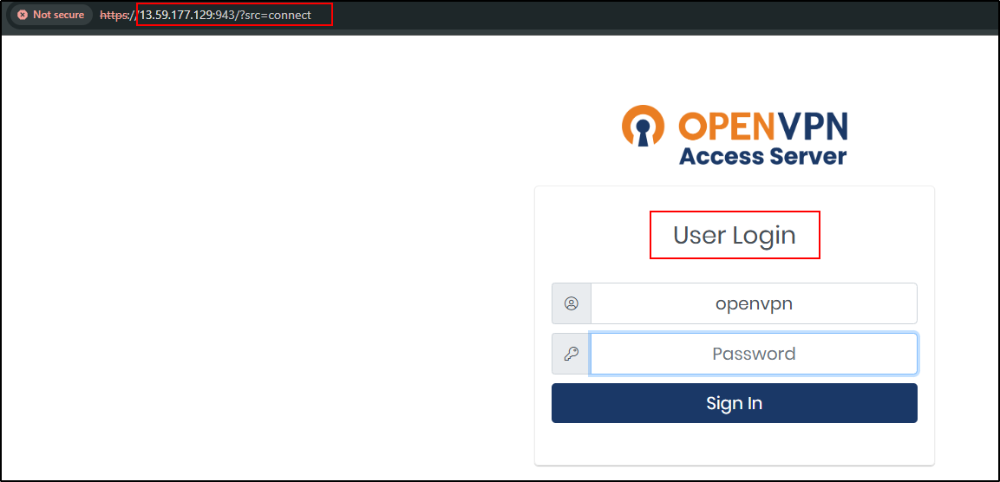

<h1 align="center">🌐 Cloud-Based VPN with AWS & OpenVPN</h1>

  A practical lab deploying a secure, free VPN server in the cloud using Amazon Web Services and OpenVPN for encrypted traffic tunneling.

<h2>🚀 Summary</h2>

  In this lab, I deployed a functional VPN server in the cloud using OpenVPN on an AWS EC2 instance. This allowed for private, secure web browsing by routing all client traffic through the VPN tunnel. The project included server setup, client connection, and testing IP anonymization via cloud infrastructure.

<h2>
🗂️ Project Architecture</h2>

<h2>🛠️ Deployment Overview</h2>

<ol>
  <li>
    Launched an EC2 instance on AWS and installed the OpenVPN Access Server. 
    
  </li>
  <li>
    SSH’d into the server, completed the setup script, and generated an admin login password. 
    
  </li>
  <li>
    Accessed the OpenVPN web admin portal at <code>https://13.59.177.129:943/admin/</code> and logged in using the credentials. 
    
  </li>
  <li>
    Configured the server to tunnel all client traffic through the VPN (full tunnel setup). 
     
  </li>
  <li>
    Connected to the client side by visiting the user portal with the same credentials. 
    
  </li>
  <li>
    Downloaded and installed the OpenVPN Connect client on my Windows 11 Home Desktop. 
    
  </li>
  <li>
    Activated the VPN and verified the connection was active by checking the public IP. 
      
  </li>
  <li>
    Successfully confirmed that my IP matched the VPN server’s IP, proving encrypted routing was working. 
    
  </li>
</ol>

